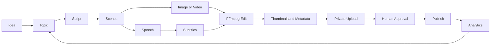

# System Architecture

## Goal

주제 입력부터 YouTube 비공개 업로드와 성과 분석까지 이어지는 재실행 가능한
다채널 자동화 파이프라인을 구축합니다.

## Pipeline

## Boundaries

- 외부 서비스는 `providers/`의 인터페이스 뒤에 둡니다.
- 제작 단계는 `pipeline/stages/`에서 공급자 구현과 분리합니다.
- 채널 차이는 `config/channels/*.yaml`로 관리하고 코드는 복제하지 않습니다.
- 각 작업은 중간 산출물과 상태를 저장해 실패한 단계부터 다시 실행합니다.
- 업로드 기본값은 `private`이며 공개 전에는 사람 승인을 거칩니다.

## Storage

- `data/jobs/`: 작업 상태와 메타데이터
- `storage/`: 생성 중인 대용량 미디어
- `output/`: 로컬 실행의 완성 결과
- `outputs/`: Codex가 사용자에게 전달하는 결과물
- `logs/`: 로컬 실행 로그

## Provider Interfaces

- Text provider: 대본, 장면, 게시 메타데이터
- Speech provider: AI 내레이션
- Image provider: 장면 이미지
- Video provider: 선택적 AI 영상
- Editor provider: FFmpeg 합성
- Upload provider: YouTube 업로드
- Analytics provider: 향후 YouTube 성과 수집

## Scale Path

MVP에서는 로컬 JSON과 순차 실행을 사용합니다. 작업량이 증가하면 SQLite,
PostgreSQL, 작업 큐 순서로 확장합니다. 데이터베이스나 큐 도입 전에도 공급자와
파이프라인 인터페이스는 유지합니다.
